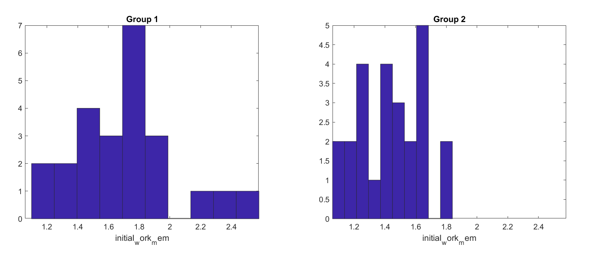
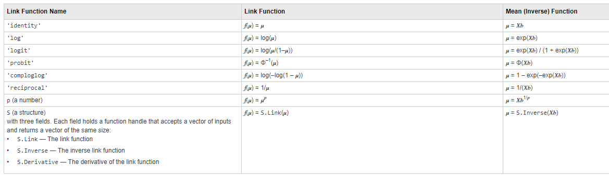
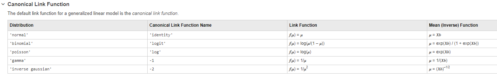
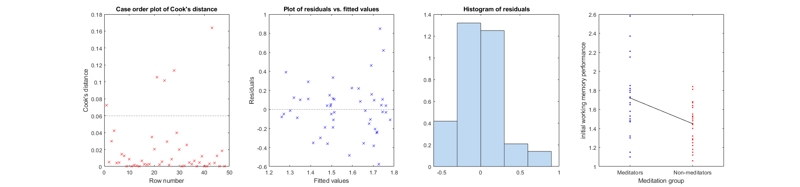
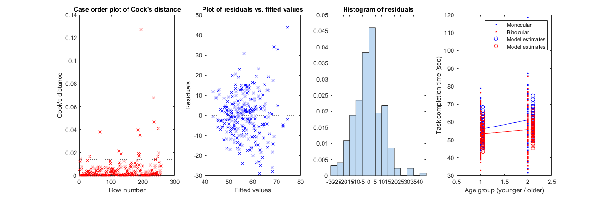
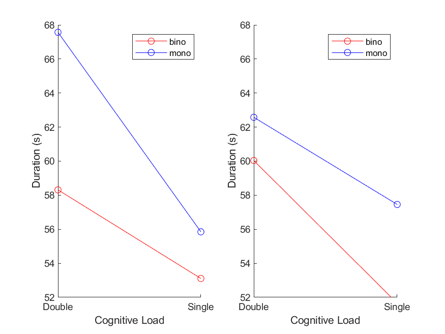

# chopin toolbox
A toolbox for automating the use of GLM/GLME statistical models

## Description
The toolbox contains various for automatical stastistical analyses, showing diagnostics, formating, a few stat tools and other handy functions for automatically plotting the data. Helper functions include functions to manipulate files and data.

## Getting Started
### Dependencies
* Tested on Matlab R2020b
* Tested on Windows 11 pro but should work cross-platforms

### Installing
* download the code
* add its root folder to your matlab search path with all the inside folders
Example: 
```matlab
addpath(genpath('C:\Users\Adrian\Desktop\chopin_toolbox'))
```

## Content
### Automated GLM (Generalized Linear Model)/ GLME (Mixed Effects) pipeline
The following functions are used together to easily separate model selection from statistical hypothesis testing. While some statisticians might be horrified by this idea, others argue that it is possible to use non-hypothesis-based metrics like AICc or adjusted R^2 to select for the best model in a first step, check for the numerous validity conditions before selecting the best model, and then do hypothesis testing using this model (using metrics like p-values and effect sizes). Keep in mind that I am not a qualified statistician.
* clean_names to clean variables names and avoid later issues
* check_distrib_indep to visualize the shape of dependent variable distribution and test whether normal with Kolmogorov-Smirnov test
* corrplot2 to check collinearity between factors
* all_glm automatically tests and ranks all GLMs/GLMEs as combinations of factors/interactions of factors/link functions
* display_model formats the results in the command window for one model in the list and show diagnostic plots for that model
* adjust_p_benjamini_hochberg: adjust p-values when using multiple separate models
* plot_group_effect/plot_covariate_effect/plot_interaction/plot_triple_interaction: plot the results easily for one model
The following 'typical use' sections should be chained one with the other as a typical pipeline.

### Warnings
* As mentioned already, some stasticians consider that model estimation step is biasing the future hypothesis testing step and argue that you should have hypotheses and only tests them. I agree with that later part and recommend to use this toolbox only with factors that are parts of a very limited set of meaningful hypotheses.
* Another point of concern is that it is highly debatable whether it is correct or not to compare models using different link functions using AIC. The statistic is based on the model likelihood, which is itself calculated differently depending on the link function. If you are OK with that conceptual risk, please move further.
* When using GLM and GLME, many of the methods working well for linear regression become incorrect. Be aware of these limitations before starting.

### Preparing the data
* Make sure that all your categorical factors are defined as such. 
* If you have more than one level in a categorical factor and you want to choose which one is the reference for the dummy variable coding (default), reorder the levels so that your reference level is the first one in the list.

#### Example
```matlab
data.my_categ_factor = categorical(data.my_categ_factor); % first enforce categorical factor type on the variables that should be categorical.
data.my_categ_factor = reordercats(data.my_categ_factor,{'Reference','group2','group3'}); % reorder the levels so that your reference level is the first one in the list.
```

### check_distrib_indep
To visualize the shape of dependent variable distribution and test whether normal with Kolmogorov-Smirnov test.

* check for difference between groups using a non-paramatric test
* if not different, group data, otherwise keep separated
* plot dependent variable distributions (line 1: group 1 is on column 1, group 2 on column 2, pooled data on column 3)
* check for normality of the distribution using Kolmogorov-Smirnov test
* if non-normal, attempt to transform the data in log10 and plot it (second line)

#### Typical use
```matlab
% explore which distribution is correct
% for a categorical grouping factor:
check_distrib_indep(data.initial_work_mem(data.meditation=='yes'),data.initial_work_mem(data.meditation=='no'),'initial_work_mem'); 

% or for a numeric grouping factor:
check_distrib_indep(data.initial_work_mem(data.meditation==1),data.initial_work_mem(data.meditation==2),'initial_work_mem'); 
snapnow; %plot figure when publishing markdown code
```
Results obtained:
```
initial_work_mem - Wilcoxon-Mann–Whitney (signed-ranks) U = 800, p = 0.0017
Data are significantly different, so let's keep them separated
Kolmogorov-Smirnov tests for normality:  Group 1 - KS = 0.19, p = 0.2653 and Group 2 - KS = 0.09, p = 0.9626
```


You can see that the distributions are significantly different between groups and should therefore not be pooled. It is normal for each group though, so that 'normal' can be later selected as the distribution for the dependent variable.

### corrplot2
This function is almost identical to corrplot (Matlab included). Use it to check collinearity between factors. As a rule of thumb, only include factors that correlate together less than 0.8/-0.8. Do not include non-ordered categorical variables here.

#### Typical use
```matlab
% Only apply the collinearity analysis on continuous predictors
% Use Kendall correlations that are more powerful when using small samples
corrplot2(data(:,{'music','sport','expect'}),'type','Kendall')
snapnow; %plot figure when publishing markdown code
```
Results obtained:


Conclusion: no factor to exclude because of collinearity

### all_glm
Automatically tests and ranks all GLMs/GLMEs as combinations of factors/interactions of factors/link functions. This is the general procedure but there is a detailed case in typical use below.
* you define a data table with your data, making sure categorical group factors have the format 'categorical' (use the converting function categorical for that)
* you define the column name in data corresponding to the dependent variable, and its the distribution
Note that:
  * normal and inverse gaussian distributions are defined continuously on [-Inf, +Inf]
  * binomial and poisson distributions are counts of events and are then integers defined on [0, +Inf]
  * gamma distributions are defined continuously on ]0, +Inf]. I recommend to tranform your variable to X+eps if X is defined on [0, +Inf].
* you define a maximum number of factors to include (as a rule of thumb, you need ~10 datapoints for each, interactions are considered as factors).
* you define a cell array of liquid and solid factors: 
  * Solid factors are always included in the list (can be empty using {''}).
  * Liquid are picked in combination with solid factors until you reach the maximum number of factors (can be empty using {''}). Combinations with a number of factors inferior to the max are also included. 
  * Fixed effect factors should NOT be in parentheses, random-effect factors should be. 
  * Interaction factors are expressed as factor1:factor2. Notation factor1*factor2 also includes main effects of factor1 and factor2. 
  * Note that you can add squared factors for continuous variables (ex: 'factor^2') but refrain from doing so and prefer defining a new variable factor2 = factor^2 and work with that variable to avoid bugs.
* you define potential model links between the dependend variable and the factors - only include links that make sense, otherwise it may result in errors. Potential links are: 'log', 'reciprocal','identity','-2','-3','probit','logit','loglog','comploglog'.
  * log links require the dependent variable X to be defined on ]0, +Inf]. I recommend to tranform your variable to X+eps if X is defined on [0, +Inf].

I recommend to use the canonical link function corrresponding to your distribution whenever possible.

* optionnally exclude some outlier observations (defined as their line number in the data)
* optionnally have warnings off (better to keep them on to discover wrong link functions or wrong data - default is warnings on)
* optionnally run a GLME: you will need at least one random variable, so as a solid factor, expressed as (1|factor). Note that the parentheses are crucial to define the random-effect factor.
* optionally decide for a multiple-comparison correction method among 'benjamini-hochberg' (see section Benjamini-Hochberg procedure below for more information) or 'bonferroni' (default 'none'). This will show adjusted p-values. It is only used in function display_model, and it assumes that the number of statistical tests is equal to the number of factors in the displayed model. If not correct, you can specify a different number of comparison in the optional field model.nb_tests.
* run all_glm code
  
#### Typical use
```matlab
% define a model structure
    % a table with the data, here called data
    model.data = data;
    % the name of the dependent variable in the data structure, here it is data.initial_work_mem
    model.dv = 'initial_work_mem';
    % its distribution among poisson, normal, gamma, inverse gaussian, binomial as previously determined
    model.distribution = 'normal';
    % the maximal nb of factors to explore in the model
    model.max_nb_factors = 3;
    % a factor or a list of factors that are always included in the model (for the moment, works with only one solid factor - use '' for none)
    model.solid_factors = {'meditation'}; %keep these between {} - intercept is included by default, use '-1' as a solid factor to remove intercept
    % a list of possible factors to be included, that can be removed if needed, and the interactions terms to explore
    model.liquid_factors = {'music','sport','expect','music:meditation','expect:meditation'}; %keep these between {}
    % a list of potential model links
    model.links = {'log', 'identity'};
    % outliers/subjects to be removed - can be left empty
    model.exclude = [8,12]; 
    % no warnings if 1 - careful with that option
    model.warning_off = 0; 
    % whether to use a GLM (0) or a GLME (1).
    model.glme = 0; 

% run the model
mdls = all_glm(model);
```

Results obtained:
```
We tested 30 models.
    Rank                                      formula                                           link         AICc     adj.R2(%)    R2(%)    norm.res.
    ____    ____________________________________________________________________________    ____________    ______    _________    _____    _________

      1     {'initial_work_mem ~ 1 + meditation + music + sport'                       }    {'log'     }    18.619        24       28.7      {'yes'} 
      2     {'initial_work_mem ~ 1 + meditation + music + sport'                       }    {'identity'}     19.18      23.2       27.9      {'yes'} 
      3     {'initial_work_mem ~ 1 + meditation + music'                               }    {'log'     }    19.451      20.7         24      {'yes'} 
      4     {'initial_work_mem ~ 1 + meditation + music'                               }    {'identity'}    19.765      20.3       23.5      {'yes'} 
      5     {'initial_work_mem ~ 1 + meditation + music + music:meditation'            }    {'identity'}    19.925        22       26.8      {'yes'} 
      6     {'initial_work_mem ~ 1 + meditation + music + music:meditation'            }    {'log'     }    20.092      21.8       26.6      {'yes'} 
      7     {'initial_work_mem ~ 1 + meditation + sport'                               }    {'log'     }    20.382      19.3       22.6      {'yes'} 
      8     {'initial_work_mem ~ 1 + meditation + sport'                               }    {'identity'}    20.489      19.1       22.4      {'yes'} 
      9     {'initial_work_mem ~ 1 + meditation + sport + music:meditation'            }    {'log'     }    20.611        21       25.8      {'yes'} 
     10     {'initial_work_mem ~ 1 + meditation + music:meditation'                    }    {'log'     }    20.915      18.4       21.7      {'yes'} 
     11     {'initial_work_mem ~ 1 + meditation + sport + music:meditation'            }    {'identity'}    21.087      20.2       25.1      {'yes'} 
     12     {'initial_work_mem ~ 1 + meditation + music + expect:meditation'           }    {'log'     }    21.184        20       24.9      {'yes'} 
     13     {'initial_work_mem ~ 1 + meditation + music:meditation'                    }    {'identity'}    21.276      17.8       21.2      {'yes'} 
     14     {'initial_work_mem ~ 1 + meditation + music + expect:meditation'           }    {'identity'}    21.409      19.7       24.6      {'yes'} 
     15     {'initial_work_mem ~ 1 + meditation + music + expect'                      }    {'log'     }    21.498      19.5       24.5      {'yes'} 
     16     {'initial_work_mem ~ 1 + meditation + music + expect'                      }    {'identity'}    21.719      19.2       24.1      {'yes'} 
     17     {'initial_work_mem ~ 1 + meditation + expect:meditation'                   }    {'identity'}    21.926      16.7       20.1      {'yes'} 
     18     {'initial_work_mem ~ 1 + meditation + expect:meditation'                   }    {'log'     }    22.027      16.6         20      {'yes'} 
     19     {'initial_work_mem ~ 1 + meditation + expect'                              }    {'identity'}      22.3      16.1       19.5      {'yes'} 
     20     {'initial_work_mem ~ 1 + meditation + expect'                              }    {'log'     }    22.389        16       19.4      {'yes'} 
     21     {'initial_work_mem ~ 1 + meditation + sport + expect:meditation'           }    {'log'     }     22.64      17.7       22.7      {'yes'} 
     22     {'initial_work_mem ~ 1 + meditation + sport + expect:meditation'           }    {'identity'}    22.714      17.6       22.6      {'yes'} 
     23     {'initial_work_mem ~ 1 + meditation + sport + expect'                      }    {'log'     }    22.748      17.5       22.6      {'yes'} 
     24     {'initial_work_mem ~ 1 + meditation + music:meditation + expect:meditation'}    {'log'     }    22.797      17.4       22.5      {'yes'} 
     25     {'initial_work_mem ~ 1 + meditation + sport + expect'                      }    {'identity'}    22.852      17.3       22.4      {'yes'} 
     26     {'initial_work_mem ~ 1 + meditation + music:meditation + expect:meditation'}    {'identity'}    23.041        17       22.1      {'yes'} 
     27     {'initial_work_mem ~ 1 + meditation + expect + music:meditation'           }    {'log'     }    23.093      16.9         22      {'yes'} 
     28     {'initial_work_mem ~ 1 + meditation + expect + music:meditation'           }    {'identity'}    23.357      16.5       21.6      {'yes'} 
     29     {'initial_work_mem ~ 1 + meditation + expect + expect:meditation'          }    {'identity'}    23.462      16.3       21.4      {'yes'} 
     30     {'initial_work_mem ~ 1 + meditation + expect + expect:meditation'          }    {'log'     }    23.491      16.3       21.4      {'yes'} 
```
Models are ranked by lowest AICc. Here we follow ref. [1] showing that AIC/AICc/BIC are better criterion than R2/adj.R2 for selecting among non-linear regression models. See section interpretation of AIC below for more information.
Warning: when choosing the best model with different link functions, use adj.R2 to rank the models rather than AIC. AIC can use very different formulas depending on the link function.
In a glance, you can find the line of the model that satisfies the following conditions:
* low AICc
* positive adjusted R^2
* R^2 that is large enough for you to qualify as a useful model (note that you can also use R^2 to compare a GLM with a GLME)
* Normality of residuals

Once you have a candidate, the next step is to check the validity of that candidate with the diagnostics plots.

### display_model 
* displays variable formats for the best model in command window
* displays best model's stats in command window (fixed effects)
* displays best model's stats in command window (random effects)
* displays diagnostic figures and tests in command window
* displays adjusted p-values in command window
* displays formatted hypothesis rejection in command window
* displays local effect sizes

The diagnostics are:
* Scatterplot of residuals vs. fitted values - no fanning should be observed (fanning is an increase of residuals variability at larger fitted values). In addition, there should be no relationship between residuals and fitted values. On these two points, ref. [3] argues that deviations are actually expected for some of the GLMs (e.g. Poisson regression or logistic regression) and that it should be no ground for model exclusion (use deviance residuals instead). Note that this plots are difficult to interpret in the context of binomial distributions and logistic regression (we plan to expand later for that case). 
* Distribution of residuals - should be normal, indicated by a non-significant Kolmogorov-Smirnov test (result displayed in the command window). Note that this plots are difficult to interpret in the context of binomial distributions and logistic regression (we plan to expand later for that case). 
* Cook's distance for each observation: this shows how the model prediction depends on the value of a single observation - outliers have very different values compared to the others and a value above 1 [2]. The plot is not available for GLME.

#### Typical use
```matlab
% display diagnostics and results
display_model(mdls{1}, model) %plot model ranked 1 - you can select any other models by rank according to the results on the various indicators provided
snapnow; %plot figure when publishing markdown code
```

Results obtained:
```
Best model (checked for outliers, fanning and normality of residuals):
Summary of variable formats in the model
                    Class          Range        InModel    IsCategorical
                  __________    ____________    _______    _____________

    meditation    {'double'}    {1×2 double}     true          false    
    sport         {'double'}    {1×2 double}     true          false    

Summary of the model

Generalized linear regression model:
    log(initial_work_mem) ~ 1 + meditation + sport
    Distribution = Normal

Estimated Coefficients:
                    Estimate        SE         tStat       pValue  
                   __________    _________    _______    __________

    (Intercept)       0.73719     0.079089      9.321    4.4876e-12
    meditation       -0.15394     0.052259    -2.9457     0.0050876
    sport          -1.105e-05    6.256e-06    -1.7663      0.084127


48 observations, 45 error degrees of freedom
Estimated Dispersion: 0.0755
F-statistic vs. constant model: 7.45, p-value = 0.00161
AICc: 15.6783
Adjusted R^2: 21.5%
R^2: 24.9%
Residuals: Kolmogorov test for normality (alpha 5%):  KS = 0.12, p = 0.4779
Residuals are normal
No adjustment for multiple comparisons
         Name          tStat     DF     pValue      adj_pValue    H_reject  
    ______________    _______    __    _________    __________    ________

    {'meditation'}    -2.9457    45    0.0050876    0.0050876     true 
    {'sport'     }    -1.7663    45     0.084127     0.084127     false

Significant effect of meditation (t(45) = -2.95, adjusted p = 0.0050876)
No significant effect of sport (t(45) = -1.77, adjusted p = 0.084127)
```

As you can see, the best model according to AICc shows 
* no outlier (first plot of Cook's distance - no datapoint is both above 1 and far away from the other datapoints)
* a little bit of fanning: in other words, there is more variability of the residuals for larger fitted values. That could possibly be resolved by changing the distribution, the link function or transforming the dependent variable in log. 
* normality of residuals (p = 0.64)
* explain a good share of the variance (R^2 and adjusted R^2 - personal criterion)

Now if you are happy with this model fit, you can decide to look at the stastitics and interpret the results. This model shows a significant effect of meditation and music factors on the dependent variable.

### Model interpretation
To interpret statistical analyses, you will need to:
* interpret which factor is significant, possibly after correcting for multiple comparisons: use for example adjust_p_benjamini_hochberg 
* interpret the coefficients
* interpret forms of effect sizes (display_model automatically proposes an effect size for continuous dependent variables)
* plot the data to see the direction of the effects: use for example plot_group_effect / plot_covariate_effect / plot_interaction / plot_triple_interaction

#### Interpreting significance
* Find how many hypotheses that you have planned are actually tested in your different models. 
* Correct for that number of comparisons using display_model with option model.p_adjust_method ('bonferroni' or 'benjamini-hochberg') and model.nb_tests.
* If you are using 'benjamini-hochberg' (see dedicated section below) and have several different models, you may want to correct for all the comparisons in all the models. In that case, use adjust_p_benjamini_hochberg as follows:
```matlab
 model.p_adjust_method = 'none';
 table_stats_1 = display_model(mdls1{1});
 table_stats_2 = display_model(mdls2{1});
 adjust_p_benjamini_hochberg([table_stats_1; table_stats_2])
```

Possible results: you can see the adjusted pValue for factors of different analyses/dv, here Mean_Velocity_T_Hands and Speed_Metric_T_Hands.
```matlab
Adjustment for multiple comparisons: method of Benjamini-Hochberg
                   Name                    Estimate      tStat     DF      pValue      adj_pValue    H0_reject    adj_alpha
    ___________________________________    _________    _______    ___    _________    __________    _________    _________

    {'Mean_Velocity_T_Hands: trial'   }    0.0030797     3.2325    508    0.0013068    0.0078409         1        0.0083333
    {'Mean_Velocity_T_Hands: load_S'  }     0.013078     2.9954    508    0.0028745    0.0086234         1         0.016667
    {'Speed_Metric_T_Hands: load_S'   }    0.0066417     2.4715    510     0.013781     0.027562         1            0.025
    {'Mean_Velocity_T_Hands: stereo_M'}    -0.010249    -2.3475    508     0.019281     0.028922         1         0.033333

Significant effect of Mean_Velocity_T_Hands: trial (t(508) = 3.23, adjusted p = 0.0078409)
Significant effect of Mean_Velocity_T_Hands: load_S (t(508) = 3, adjusted p = 0.0086234)
Significant effect of Speed_Metric_T_Hands: load_S (t(510) = 2.47, adjusted p = 0.027562)
Significant effect of Mean_Velocity_T_Hands: stereo_M (t(508) = -2.35, adjusted p = 0.028922)
```

* Tips: if you get a significant interaction term, it should automatically includes the main effect terms. If it does not, it is better to add them. Select the model which has them (possibly add them as solid factors to be sure).

#### Interpreting coefficients 
To interpret coefficients in a GLM, you need to understand the meaning of the coefficients, which depend on the link function and chosen distribution: 
* with logit link (logistic regression), the coefficients represent the log-odds. So you can exponentiate the coefficients to get odds ratios. This can be interpreted as the factor by which the odds of the outcome increase (or decrease) for a one-unit change in the predictor. For example, a beta of 0.3 is associated with an odds ratio of exp(0.3) = 1.35, which means that the odds of the event are 1.35 higher for each one-unit increase in the predictor.
```matlab
odds_ratios = exp(mdls{1}.Coefficients.Estimate); % mdls{1} is the best model in the list
```
Now it is easier to think about changes in the probabilities of an event (or risk variation) rather than about changes in odds. You can instead convert the odds ratios to relative risk by using the probability of the event for a specific value of your predictor. I recommmend this article for this: https://www.r-bloggers.com/2014/01/how-to-convert-odds-ratios-to-relative-risks/
Briefly, if your predictor varies between x and y, and the risk at x is px = 0.5 and at y is py = 0.6, then you can use this formula to calculate the range of relative risks:
```matlab
Relative Risk at x = (odds ratio) / (1 – px + (px.odds ratio)) = RRx
Relative Risk at y = (odds ratio) / (1 – py + (py.odds ratio)) = RRy
```
So the relative risk varies between RRx = 1.15 and RRy = 1.12 and you can conclude that there is approximately 1.13 times more risk of the event for each unit-change in your predictor, or a 13% risk increase.
* with a Poisson log regression, they represent the log of the expected count. So the exponential of the coefficients represents the multiplicative effect on the expected count.
* log link with normal distribution: the coefficients can be interpreted as the percentage change in the expected value of the dependent variable for a one-unit change in the predictor.
* In gamma distributions, only the location parameter is estimated and reflected in the coefficients, not the shape one.
```matlab
percentChangeByFactor = 100.*exp(mdls{1}.Coefficients.Estimate(2:end)); % mdls{1} is the best model in the list / we do not include intercept
```
Note 1: It is generally good to look at the literature to understand how to interpret coefficients and how to extract effect sizes.
Note 2: To obtain standardized coefficients: you can standardize your predictors before fitting the model. The resulting coefficients will then be in units of standard deviations.

#### Interpreting effect sizes 
To interpret the importance of one specific factor in the model (effect size equivalent) for continuous factors, one possible strategy is to compare R2 with and without the factor of interest. Please do due diligence on the question before doing that. In the current version, we are following Selya et al. (2012) - A Practical Guide to Calculating Cohents f2, a Measure of Local Effect Size, from PROC MIXED.
We calculate a local Cohen's f2 (f squared) for mixed effect model for each factor by using the formula (for factor A):
f2_A = (R2minusA - R2_all) / (1 - R2_all)
with R2_all the R squared when all factors are in the model, and R2_minusA the R squared when all the factors minus A are included. Note that R2 is calculated here using the ordinary method and you could use the deviance method instead for GLME.
For categorical factors, using Cohen's d is more appropriate. We calculate d from t and df for this factor, using a formula from Rosenthal and Rosnow, 1991. We interpret effect sizes using Cohen's (1992) guidelines expanded by Sawilowsky (2009). Note that we are not correcting for correlated designs here, so interpret sizes with caution. Note 2: most effect sizes will be inaccurate in the context of a logistic regression.

An example of output obtained is:
```matlab
Local effect size for trial : Cohen's f2 = 0.21 (medium)
Local effect size for stereo:ageGroup : Cohen's d = 0.5 (medium)
 -------------------------------------------------------------------------------
```

For GLMs (not GLMEs), one can also estimate a pseudo R2 instead of the provided R2, following equation (8.9) in [4].
```matlab
pseudoR2 = (mdls_intercept{1}.LogLikelihood-mdls{1}.LogLikelihood)/mdls_intercept{1}.LogLikelihood
```
For GLME, deviance can be used instead of log likelihood.

Known bug:
* if one want to use effect_sizes with quadratic factors (X^2), consider defining a new variable X2 = X^2 to avoid multiple problems with fitglm and effect sizes.

### plot_group_effect / plot_covariate_effect / plot_interaction / plot_triple_interaction / plot_covariate_interaction
Plots the results for one selected model. For these functions to work, make sure grouping factors have categorical format (using function categorical).
Warning: these functions work for grouping factors with 2 levels only!

#### Typical use
```matlab
% add plots of results and save figures
% there is an empty subplot that I like to fill with a figure showing the most interesting result, here a significant meditation group effect
h=subplot(1,4,4);
plot_group_effect(data.final_orient, data.meditation, h, 'Meditation group', 'final orientation threshold', '',0, model)

% save the figure
saveas(gcf,fullfile(figure_path,'results.png')); 
snapnow; %plot figure when publishing markdown code
```

Note that the group effect plot code works only with a grouping variable with two levels (at the moment).

For a continuous factor or an interaction relationship, you can use plot_covariate_effect or plot_interaction instead. The example below plots the effect of music practice in hours on our dependent variable.
```matlab
h=subplot(1,4,4);
plot_covariate_effect(data.initial_work_mem, data.music, h, 'Music practice (hours)', 'initial working memory performance', 0, 0, mdls{1},1,model);
```


This one below looks at an interaction between age group and stereo condition for the Time dependent variable.
```matlab
h=subplot(1,4,4);
plot_interaction(data.Time, data.stereo,data.ageGroup, h, 'Age group (younger / older)','Task completion time (sec)', '',mdls{1}, 1, model)
```

Note that the interaction plot code works only with a grouping variable with two levels (at the moment).

This one below looks at a triple interaction between age group, hands and stereo condition for the Speed_Metric_T_Hands dependent variable.
```matlab
h=subplot(1,1,1);
plot_triple_interaction(data.duration, data.load, data.stereo, 'Cognitive Load', 'Duration (s)', [], [], model) 
```


This one below looks at an interaction between a group factor (ageGroup) and a continuous factor (music) for the initial_orient dependent variable.
h=subplot(1,3,3); 
% plot_covariate_effect(data.initial_orient, data.music, data.ageGroup, h, 'Music practice (hours)', 'initial orientation threshold', [], 0, 0, mdls{1}, 1, model)

## Some additional information
### Interpretation of AIC
As a rule of thumb, models with an AIC difference less than 2 are considered to have ‘substantial’ support, models with an AIC difference between 4 and 7 to have ‘considerably less’ support, and models with an AIC difference greater than 10 to have ‘essentially no’ support [5]. Be sure to also read Burnham, Anderson, and Huyvaert et al., 2011 paper.

### Benjamini-Hochberg procedure
The Benjamini-Hochberg procedure is a method for controlling the False Discovery Rate (FDR) in multiple hypothesis testing. In the context of statistical hypothesis testing, when you are conducting multiple tests simultaneously, the likelihood of making at least one Type I error (rejecting a true null hypothesis) increases. The FDR is the expected proportion of false discoveries among all rejected hypotheses.

Here is a step-by-step explanation of the Benjamini-Hochberg procedure:
* Sort p-values: Begin by sorting the p-values obtained from your individual hypothesis tests in ascending order.
* Assign ranks: Assign ranks to the sorted p-values. The smallest p-value gets a rank of 1, the second smallest gets a rank of 2, and so on.
* Calculate critical value: Choose a pre-specified FDR level, denoted as alpha, which is the maximum acceptable proportion of false discoveries., typically 0.05. The critical value (c) is calculated as 
    c = alpha*rc/m
where rc is the rank of the largest p-value that still satisfies the condition p ≤ alpha*r/m for all equal or smaller ranks, and m is the total number of tests.
* Reject hypotheses: Reject all null hypotheses corresponding to p-values smaller than or equal to the critical value c.

By controlling the FDR, the Benjamini-Hochberg procedure allows you to balance between finding a sufficient number of true positives and minimizing the number of false positives among the rejected hypotheses. It's important to note that the Benjamini-Hochberg procedure assumes that the tests are independent or positively dependent. If there are strong negative dependencies, other procedures like the Benjamini-Yekutieli procedure may be more appropriate.

## Authors
Adrien Chopin, 2023
The code is mostly made of codes from other people:
* Bayes Factor from Bart Krekelberg
* Cohen's D from Ruggero G. Bettinardi (RGB) / Cellular & System Neurobiology, CRG
* Shapiro test from Gardner-O'Kearny, William (2021). swft - Shapiro-Wilk/Shapiro-Francia Tests (https://www.mathworks.com/matlabcentral/fileexchange/<...>), MATLAB Central File Exchange. Retrieved March 13, 2021.
* Justin Theiss for check_files / check_folders functions
* sumsqr from Mark Beale, 1-31-92 / Copyright 1992-2017 The MathWorks, Inc.
  
## References
* [1] Spiess, A.-N., & Neumeyer, N. (2010). An evaluation of R2 as an inadequate measure for nonlinear models in pharmacological and biochemical research: a Monte Carlo approach. BMC Pharmacology, 10(1), 1–11.
* [2] Cook, R. Dennis; Weisberg, Sanford (1982). Residuals and Influence in Regression. New York, NY: Chapman & Hall. hdl:11299/37076. ISBN 0-412-24280-X.
* [3] Coxe, S., West, S. G., & Aiken, L. S. (2013). Generalized linear models. The Oxford handbook of quantitative methods, 2, 26-51.
* [4] Dobson, A. J., & Barnett, A. G. (2018). An introduction to generalized linear models. CRC press.
* [5] Burnham, K.P., and D.R. Anderson (2004). Multimodel Inference: Understanding AIC and BIC in Model Selection. Sociological Methods & Research 33: 261–304. https://doi.org/10.1177/0049124104268644. 

## Version History
* Current version is 1.3
* Version 1.3 allows a more flexible to use Benjamini-Hochberg correction for analyses spanning multiple models
* Version 1.2 allows for multiple comparison correction (adjusted p-values)
* Version 1.1 includes mixed-effect model estimation (GLME).
* Version 1.0 includes various handy functions for manipulating files and data, more 'serious' functions for automatical stastistical analyses, a few stat tools and other handy functions for automatically plotting the data.

## License
This project is licensed under the MIT License - see the LICENSE.md file for details.
To use it you may also follow any license for borrowed codes (see Authors section).
